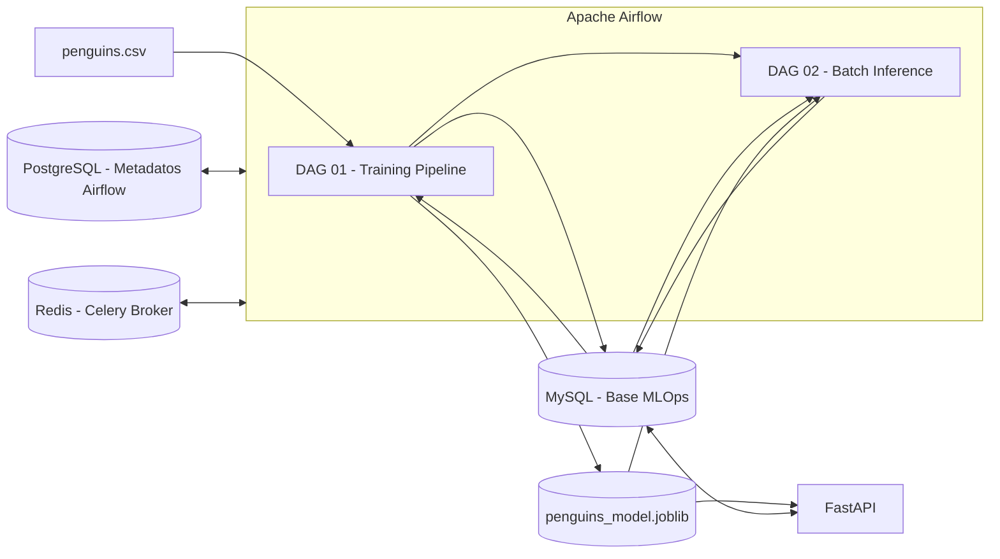
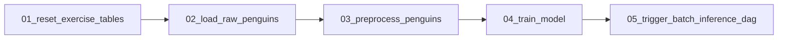
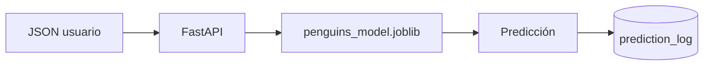
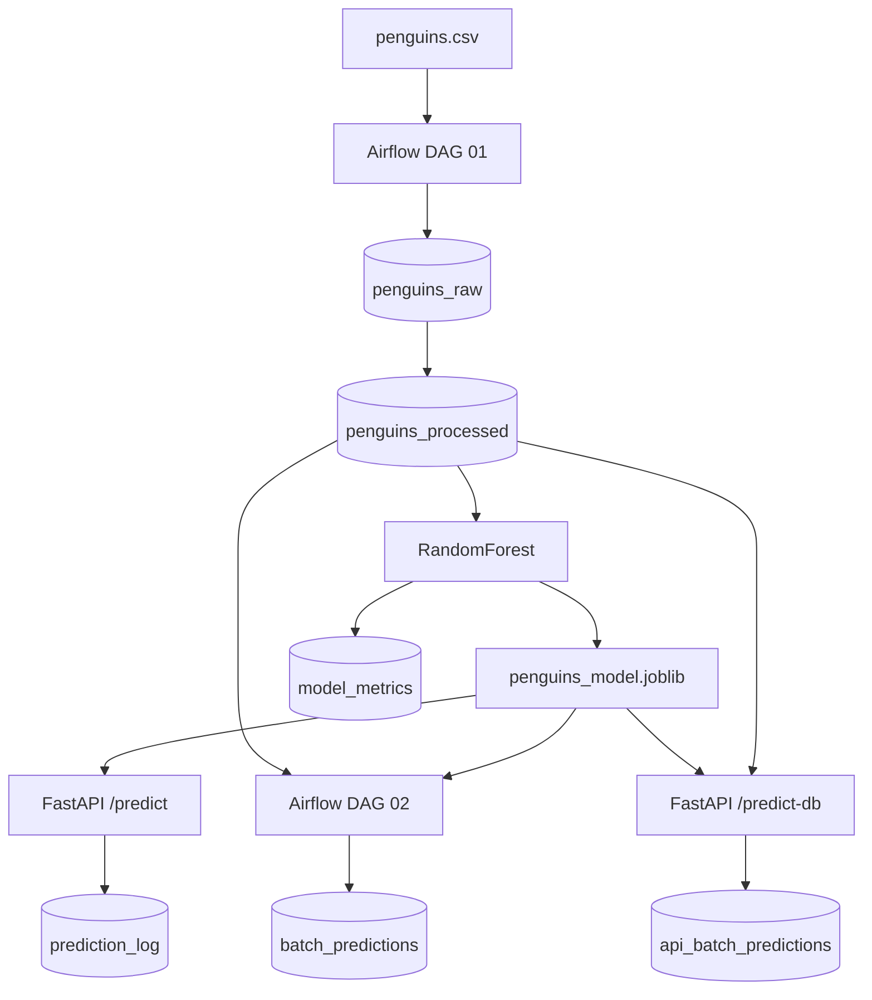

# Taller MLOps: Airflow + MySQL + FastAPI + Docker Compose

## 1. Objetivo

Construir un flujo MLOps reproducible para el dataset **Penguins**, integrando:

- **Apache Airflow 2.6.0** para orquestación.
- **PostgreSQL** exclusivamente para metadatos internos de Airflow.
- **Redis** como broker de Celery.
- **MySQL 8.0** como base de datos del ejercicio.
- **FastAPI** para servir predicciones.
- **Docker Compose** para levantar todos los servicios.
- Persistencia de datos y modelo mediante volúmenes y carpetas compartidas.

El flujo permite cargar datos crudos, preprocesarlos, entrenar un modelo, guardar métricas, ejecutar inferencia batch y exponer inferencia mediante API.

---

## 2. Arquitectura general



### Separación de responsabilidades

| Componente | Responsabilidad |
|---|---|
| PostgreSQL | Metadatos internos de Airflow |
| Redis | Broker de Celery |
| MySQL | Datos del ejercicio, métricas y predicciones |
| Airflow DAG 01 | Carga, preprocesamiento y entrenamiento |
| Airflow DAG 02 | Inferencia batch |
| `model/` | Persistencia del modelo entrenado |
| FastAPI | Inferencia online y batch bajo demanda |

> **Importante:** PostgreSQL y MySQL cumplen funciones diferentes. La base del ejercicio no debe mezclarse con la base de metadatos de Airflow.

---

## 3. Estructura del proyecto

```text
Taller_2/
│
├── docker-compose.yml
├── Dockerfile.airflow
├── requirements-airflow.txt
│
├── dags/
│   ├── 01_penguins_training_pipeline.py
│   └── 02_penguins_batch_inference.py
│
├── data/
│   └── penguins.csv
│
├── model/
│   └── penguins_model.joblib
│
├── logs/
├── plugins/
│
└── api/
    ├── Dockerfile
    ├── requirements.txt
    └── main.py
```

---

## 4. Servicios Docker Compose

El `docker-compose.yml` contiene:

```text
redis
postgres
mysql
airflow-init
airflow-scheduler
airflow-triggerer
airflow-webserver
airflow-worker
ml-api
```

Puertos principales:

| Servicio | Puerto |
|---|---:|
| Airflow Webserver | `8080` |
| FastAPI | `8000` |

Ejemplos:

```text
http://IP_VM:8080
http://IP_VM:8000/docs
```

---

## 5. Persistencia

Se usan dos volúmenes principales:

```text
taller_airflow_postgres_data
taller_mysql_mlops_data
```

Además, el modelo se comparte mediante:

```text
./model:/opt/ml/model
```

Airflow escribe el modelo y FastAPI lo lee.

Para detener los servicios sin borrar datos:

```bash
docker compose down
```

Evitar:

```bash
docker compose down -v
```

salvo que se quiera borrar intencionalmente toda la persistencia.

---

## 6. Rocky Linux y SELinux

En Rocky Linux se usaron bind mounts con `:z`:

```yaml
- ./dags:/opt/airflow/dags:z
- ./logs:/opt/airflow/logs:z
- ./plugins:/opt/airflow/plugins:z
- ./data:/opt/ml/data:ro,z
- ./model:/opt/ml/model:z
```

Para verificar SELinux:

```bash
getenforce
```

`Enforcing` es válido siempre que los montajes tengan el contexto adecuado.

---

## 7. Inicialización de Airflow

Inicialmente `airflow-init` mostraba:

```text
ERROR: You need to initialize the database.
Please run `airflow db init`.
```

Se corrigió haciendo explícita la inicialización:

```bash
set -e

airflow db init

airflow users create   --username airflow   --password airflow   --firstname Airflow   --lastname Admin   --role Admin   --email airflow@example.com || echo "El usuario airflow ya existe"

airflow db check
airflow version
```

Validación:

```bash
docker compose up airflow-init
docker compose ps -a
```

Resultado esperado:

```text
airflow-init    Exited (0)
```

---

## 8. Levantar servicios

```bash
docker compose up -d
```

Validar:

```bash
docker compose ps
```

Los servicios deben aparecer como `Up` o `healthy`.

---

## 9. DAG 01: entrenamiento

DAG:

```text
01_penguins_training_pipeline
```

Flujo:



### 9.1 `01_reset_exercise_tables`

Elimina tablas previas del ejercicio:

```text
penguins_raw
penguins_processed
model_metrics
batch_predictions
prediction_log
api_batch_predictions
```

No elimina MySQL, el volumen, PostgreSQL ni metadatos de Airflow.

### 9.2 `02_load_raw_penguins`

Lee:

```text
/opt/ml/data/penguins.csv
```

y lo carga sin preprocesamiento en:

```text
penguins_raw
```

### 9.3 `03_preprocess_penguins`

Lee `penguins_raw` y realiza:

- selección de variables;
- eliminación de nulos;
- eliminación de duplicados;
- conversión de `species` a `target`.

Genera:

```text
penguins_processed
```

Variables:

```text
bill_length_mm
bill_depth_mm
flipper_length_mm
body_mass_g
```

Objetivo:

```text
target
```

### 9.4 `04_train_model`

Lee `penguins_processed` y entrena:

```text
RandomForestClassifier
```

Separa aproximadamente:

```text
75 % entrenamiento
25 % prueba
```

El artefacto guardado contiene:

```python
{
    "model": model,
    "features": FEATURES,
    "id_to_species": id_to_species,
    "accuracy": accuracy,
    "trained_at_utc": ...
}
```

Archivo:

```text
model/penguins_model.joblib
```

Además crea:

```text
model_metrics
```

### 9.5 `05_trigger_batch_inference_dag`

Cuando el entrenamiento termina correctamente, dispara:

```text
02_penguins_batch_inference
```

---

## 10. DAG 02: inferencia batch

DAG:

```text
02_penguins_batch_inference
```

Flujo:


Valida que exista:

- `penguins_model.joblib`;
- `penguins_processed`;
- datos disponibles.

Luego ejecuta:

```python
model.predict(...)
```

y guarda resultados en:

```text
batch_predictions
```

---

## 11. Ajuste realizado: DAGs vacíos

Airflow inicialmente mostraba:

```text
No data found
```

Los archivos DAG existían, pero tenían:

```text
0 bytes
```

Validación:

```bash
docker compose exec airflow-scheduler ls -lah /opt/airflow/dags
```

Después de reemplazarlos por archivos con código:

```bash
docker compose exec airflow-scheduler airflow dags list
```

mostró ambos DAG.

También se validó:

```bash
docker compose exec airflow-scheduler airflow dags list-import-errors
docker compose exec airflow-scheduler airflow config get-value core dags_folder
```

La carpeta esperada es:

```text
/opt/airflow/dags
```

---

## 12. Ajuste realizado: permisos para guardar el modelo

La tarea `04_train_model` falló con:

```text
PermissionError: [Errno 13] Permission denied:
'/opt/ml/model/penguins_model.joblib'
```

Se corrigió con:

```bash
AIRFLOW_UID=$(grep '^AIRFLOW_UID=' .env | cut -d= -f2)
sudo chown -R ${AIRFLOW_UID}:0 model
sudo chmod -R 775 model
```

Validación:

```bash
docker compose exec airflow-worker touch /opt/ml/model/prueba_escritura.txt
rm model/prueba_escritura.txt
```

También se probó `joblib`:

```bash
docker compose exec airflow-worker python -c "import joblib; joblib.dump({'prueba':'ok'}, '/opt/ml/model/prueba.joblib'); print('OK')"
```

---

## 13. FastAPI

Servicio:

```text
ml-api
```

Swagger:

```text
http://IP_VM:8000/docs
```

Endpoints:

```text
GET  /
GET  /health
POST /predict
POST /predict-db
```

---

## 14. Predicción individual con FastAPI

Endpoint:

```text
POST /predict
```

Ejemplo:

```bash
curl -X POST http://localhost:8000/predict -H "Content-Type: application/json" -d '{
  "bill_length_mm": 39.1,
  "bill_depth_mm": 18.7,
  "flipper_length_mm": 181,
  "body_mass_g": 3750
}'
```

Flujo:



Las predicciones se registran en:

```text
prediction_log
```

---

## 15. Predicción batch desde FastAPI

Endpoint:

```text
POST /predict-db
```

Ejemplo:

```bash
curl -X POST "http://localhost:8000/predict-db?limit=10"
```

Flujo:


Resultados:

```text
api_batch_predictions
```

---

## 16. Diferencia entre inferencia Airflow y FastAPI

| Flujo | Origen | Destino |
|---|---|---|
| DAG 02 | Airflow | `batch_predictions` |
| `/predict` | Petición HTTP | `prediction_log` |
| `/predict-db` | FastAPI + MySQL | `api_batch_predictions` |

Así se demuestran dos modos de consumo del mismo modelo: batch orquestado e inferencia bajo demanda.

---

## 17. Ajuste realizado: incompatibilidad NumPy

FastAPI presentó:

```text
ValueError: numpy.dtype size changed,
may indicate binary incompatibility.
```

La causa fue una combinación incompatible de versiones.

Se fijaron versiones:

```text
numpy==1.24.4
scipy==1.10.1
pandas==1.5.3
scikit-learn==1.2.2
joblib==1.2.0
PyMySQL==1.1.0
SQLAlchemy==1.4.49
fastapi==0.95.2
uvicorn==0.22.0
pydantic==1.10.13
```

Reconstrucción:

```bash
docker compose build --no-cache ml-api
```

Validación:

```bash
docker run --rm taller-penguins-api:1.0 python -c "import numpy,pandas,scipy,sklearn,joblib; print('IMPORTACIONES OK')"
```

---

## 18. Ajuste realizado: typo en Pydantic

Durante el build apareció:

```text
No matching distribution found for pydantic==1.10.13i
```

La línea incorrecta era:

```text
pydantic==1.10.13i
```

La correcta:

```text
pydantic==1.10.13
```

Para revisar caracteres extraños:

```bash
cat -A api/requirements.txt
```

---

## 19. Ajuste realizado: dependencia `dill`

FastAPI pudo iniciar, pero al cargar el modelo respondió:

```json
{
  "detail": "No se pudo cargar el modelo: No module named 'dill'"
}
```

Se debe comprobar la versión presente en Airflow:

```bash
docker compose exec airflow-worker python -c "import dill; print(dill.__version__)"
```

Después agregar la misma versión a:

```text
api/requirements.txt
```

Ejemplo:

```text
dill==0.3.6
```

Luego:

```bash
docker compose build --no-cache ml-api
docker compose up -d --force-recreate ml-api
```

Validación:

```bash
docker compose exec ml-api python -c "import joblib; a=joblib.load('/opt/ml/model/penguins_model.joblib'); print(type(a)); print('MODELO CARGADO OK')"
```

---

## 20. Recomendación clave: alinear entornos

Para evitar errores de serialización, las bibliotecas principales deben ser iguales o compatibles en Airflow Worker y FastAPI:

```text
python
numpy
scipy
pandas
scikit-learn
joblib
dill
```

Airflow:

```bash
docker compose exec airflow-worker python -c "import numpy,pandas,sklearn,joblib; print(numpy.__version__, pandas.__version__, sklearn.__version__, joblib.__version__)"
```

FastAPI:

```bash
docker compose exec ml-api python -c "import numpy,pandas,sklearn,joblib; print(numpy.__version__, pandas.__version__, sklearn.__version__, joblib.__version__)"
```

---

## 21. Health checks

Airflow:

```bash
curl http://localhost:8080/health
```

FastAPI:

```bash
curl http://localhost:8000/health
```

Resultado esperado en FastAPI:

```json
{
  "api": "ok",
  "mysql": "ok",
  "model_ready": true,
  "model_path": "/opt/ml/model/penguins_model.joblib"
}
```

---

## 22. Verificar que FastAPI y Airflow usan la misma MySQL

Desde Airflow:

```bash
docker compose exec airflow-worker python -c "import os; print(os.getenv('MYSQL_HOST')); print(os.getenv('MYSQL_DATABASE'))"
```

Desde FastAPI:

```bash
docker compose exec ml-api python -c "import os; print(os.getenv('MYSQL_HOST')); print(os.getenv('MYSQL_DATABASE'))"
```

Ambos deben mostrar:

```text
mysql
mlops
```

---

## 23. Tablas esperadas en MySQL

```bash
docker compose exec mysql mysql -umlops_user -pmlops_pass_2026 -Dmlops -e "SHOW TABLES;"
```

Tablas esperadas:

```text
penguins_raw
penguins_processed
model_metrics
batch_predictions
prediction_log
api_batch_predictions
```

| Tabla | Función |
|---|---|
| `penguins_raw` | Dataset original sin preprocesar |
| `penguins_processed` | Datos preparados para ML |
| `model_metrics` | Métricas del entrenamiento |
| `batch_predictions` | Predicciones creadas por DAG 02 |
| `prediction_log` | Predicciones individuales de FastAPI |
| `api_batch_predictions` | Predicciones batch de `/predict-db` |

---

## 24. Comandos de diagnóstico recomendados

Servicios:

```bash
docker compose ps
```

DAGs:

```bash
docker compose exec airflow-scheduler airflow dags list
```

Errores de DAG:

```bash
docker compose exec airflow-scheduler airflow dags list-import-errors
```

Modelo:

```bash
ls -lh model
docker compose exec ml-api ls -lh /opt/ml/model
```

MySQL:

```bash
docker compose exec mysql mysql -umlops_user -pmlops_pass_2026 -Dmlops -e "SHOW TABLES;"
```

Logs FastAPI:

```bash
docker compose logs --tail=100 ml-api
```

Logs Airflow Worker:

```bash
docker compose logs --tail=200 airflow-worker
```

---

## 25. Flujo completo final



---

## 26. Secuencia rápida para demostración

Verificar servicios:

```bash
docker compose ps
```

Ver DAGs:

```bash
docker compose exec airflow-scheduler airflow dags list
```

Ejecutar entrenamiento:

```bash
docker compose exec airflow-scheduler airflow dags trigger 01_penguins_training_pipeline
```

Comprobar modelo:

```bash
ls -lh model/penguins_model.joblib
```

Verificar FastAPI:

```bash
curl http://localhost:8000/health
```

Predicción individual:

```bash
curl -X POST http://localhost:8000/predict -H "Content-Type: application/json" -d '{
  "bill_length_mm": 39.1,
  "bill_depth_mm": 18.7,
  "flipper_length_mm": 181,
  "body_mass_g": 3750
}'
```

Predicción batch:

```bash
curl -X POST "http://localhost:8000/predict-db?limit=10"
```

Revisar tablas:

```bash
docker compose exec mysql mysql -umlops_user -pmlops_pass_2026 -Dmlops -e "SHOW TABLES;"
```

---

## 27. Recomendaciones finales

- Fijar siempre versiones de dependencias de ML.
- Mantener alineados los entornos de entrenamiento e inferencia.
- No mezclar PostgreSQL de Airflow con MySQL del ejercicio.
- Evitar `docker compose down -v` salvo que se quiera eliminar persistencia.
- Validar permisos de carpetas compartidas antes de entrenar.
- En Rocky Linux, conservar `:z` si SELinux está activo.
- Revisar `airflow dags list-import-errors` cuando un DAG no aparezca.
- Verificar que los archivos DAG no tengan `0 bytes`.
- Validar el modelo con `joblib.load()` dentro de FastAPI antes de probar `/predict`.
- Usar `/health` como primera prueba de integración.
- Mantener separadas las tablas batch de Airflow y FastAPI para facilitar trazabilidad.
- Para producción, sustituir credenciales de ejemplo por secretos o variables seguras.

---

## 28. Resultado esperado

```text
Docker Compose                         OK
Airflow                               OK
PostgreSQL metadata                   OK
Redis Celery broker                   OK
MySQL ejercicio                       OK
Carga RAW                             OK
Preprocesamiento                      OK
Entrenamiento                         OK
Persistencia del modelo               OK
DAG batch inference                   OK
FastAPI                               OK
Predicción individual                 OK
Predicción batch desde MySQL          OK
Persistencia de predicciones          OK
```

La arquitectura final separa claramente orquestación, almacenamiento, entrenamiento e inferencia y permite demostrar un flujo MLOps completo, reproducible y fácil de explicar.
